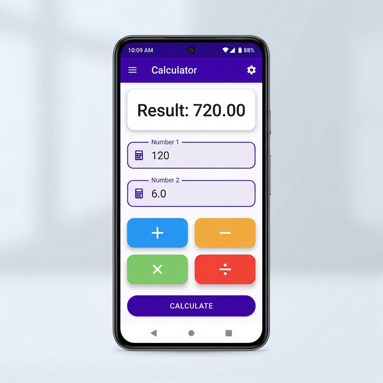

# Modern Flutter Calculator App

A beautiful, beginner-friendly calculator application built with Flutter using modern Material 3 Design principles.



## Overview

This project is a simple but elegant calculator that performs the four basic arithmetic operations. It is designed to be highly responsive, user-friendly, and an excellent starting point for beginners learning Flutter.

## Features

- **Clean & Modern UI:** Built with Flutter's Material Design 3, featuring a deep purple theme, rounded corners, and a balanced layout.
- **Basic Arithmetic:** Supports Addition (+), Subtraction (-), Multiplication (×), and Division (÷).
- **Input Validation:** Automatically handles empty fields and gracefully catches errors, such as division by zero or invalid inputs.
- **Clear Result Display:** Results and errors are clearly shown in an elevated card at the top of the screen. Red text is used for errors to enhance visibility.
- **Cross-Platform:** Can be compiled and run on Android, iOS, Windows, macOS, Linux, and the Web.

## How It Works

The app consists of a main `StatefulWidget` (`CalculatorScreen`) which manages the state of the two input fields and the result display. 

1. **Input Fields:** Two `TextField` widgets use `TextEditingController`s to capture numeric input from the user.
2. **Operations:** Clicking on any of the four operation buttons triggers a dedicated function (`_add()`, `_subtract()`, `_multiply()`, `_divide()`).
3. **Calculation Helper:** All operation functions pass a mathematical lambda to a central `_calculate()` helper method.
4. **Validation:** The helper method ensures both fields are filled, parses the inputs to `double`, and executes the lambda.
5. **State Update:** Finally, `setState()` is called to update the `_result` string, which automatically rebuilds the UI to display the answer.

## File Structure

The entire application code is contained within `lib/main.dart` to keep the project simple and easy to understand for beginners. Each section of the code contains comprehensive comments explaining the layout, state management, and widget usage.

## How to Run

1. Make sure you have the [Flutter SDK](https://flutter.dev/docs/get-started/install) installed.
2. Clone this repository:
   ```bash
   git clone https://github.com/SHARANMAYYA6070/calculator_app.git
   ```
3. Navigate to the project directory:
   ```bash
   cd calculator_app
   ```
4. Fetch dependencies:
   ```bash
   flutter pub get
   ```
5. Run the app on your connected device or emulator:
   ```bash
   flutter run
   ```

## Author
Developed as an interactive, beginner-friendly demonstration of Flutter development.
